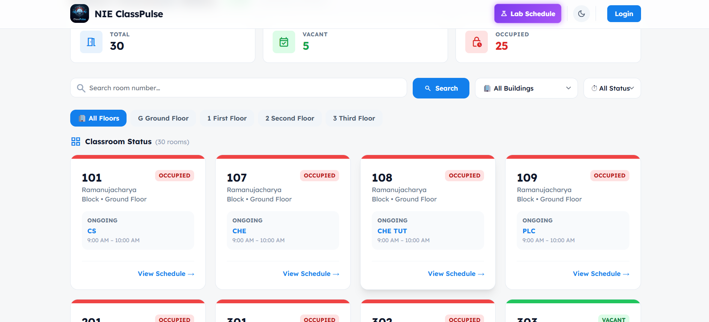
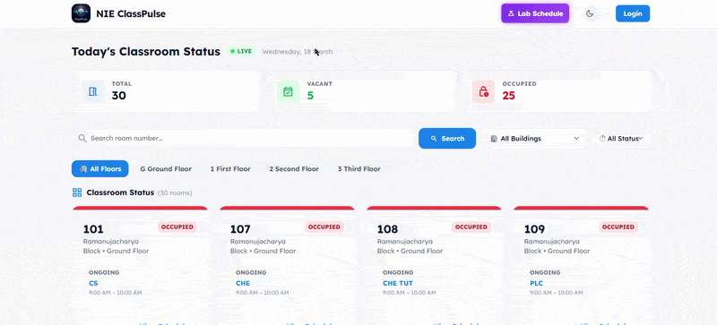

<h1 align="center">
  🚀 NIE ClassPulse
</h1>

  

  ⚡ <b>Real-Time Classroom Availability System</b> 
  <i>Stop wandering. Find classrooms instantly.</i>

  

---

<h2>🎥 Live Demo Preview</h2>

  

---

<h2>💡 Why This Exists</h2>

<ul>
  <li>🚶 Walking floor → floor to find empty class</li>
  <li>😐 Opening random doors and getting stared at</li>
  <li>⏱ Wasting 10–15 mins before every class</li> 
</ul>

<b>👉 ClassPulse fixes this.</b>

---

<h2>⚡ What This Actually Does</h2>

<ul>
  <li>📊 Shows all classrooms in one dashboard</li>
  <li>🟢🔴 Live <b>Vacant / Occupied</b> status</li>
  <li>👨‍🏫 CRs & Teachers can update room status</li>
  <li>🔄 Updates instantly for everyone</li>
</ul>

---

<h2>🧠 How It Feels</h2>

Open → See → Go → Done 
No confusion. No searching. No awkward moments.

---

<h2>🛠 Tech Stack</h2>

  
  
  
  
  

---

<h2>🔥 Features</h2>

<ul>
  <li>⚡ Realtime updates (no refresh)</li>
  <li>🔐 Role-based access</li>
  <li>📱 Clean UI</li>
  <li>🌐 Deployed on Vercel</li>
</ul>

---

<h2>🧩 Behind the Scenes</h2>

<pre>
Open Dashboard
     ↓
Fetch rooms from Supabase
     ↓
Render cards
     ↓
Realtime listener
     ↓
Teacher updates
     ↓
Everyone sees it ⚡
</pre>

---

<h2>🚀 Live Demo</h2>

👉 <a href="https://nieclasspulse.vercel.app">https://nieclasspulse.vercel.app</a>

---

<h2>🧪 Why This Hits Different</h2>

<ul>
  <li>✔ Solves real student problem</li>
  <li>✔ Uses modern backend</li>
  <li>✔ Realtime system (not basic CRUD)</li>
  <li>✔ Feels like a real product</li>
</ul>

---

<h2>👨‍💻 Our Contribution</h2>

<ul>
  <li>Designed full system</li>
  <li>Built realtime sync</li>
  <li>Created UI/UX</li>
  <li>Integrated auth + roles</li>
</ul>

---

<h2>🚧 What’s Next</h2>

<ul>
  <li>🔔 Smart notifications</li>
  <li>📅 Timetable sync</li>
  <li>🌙 Dark mode</li>
  <li>📊 Analytics</li>
</ul>

---

  ⭐ <b>Built because this SHOULD exist in every college</b>

